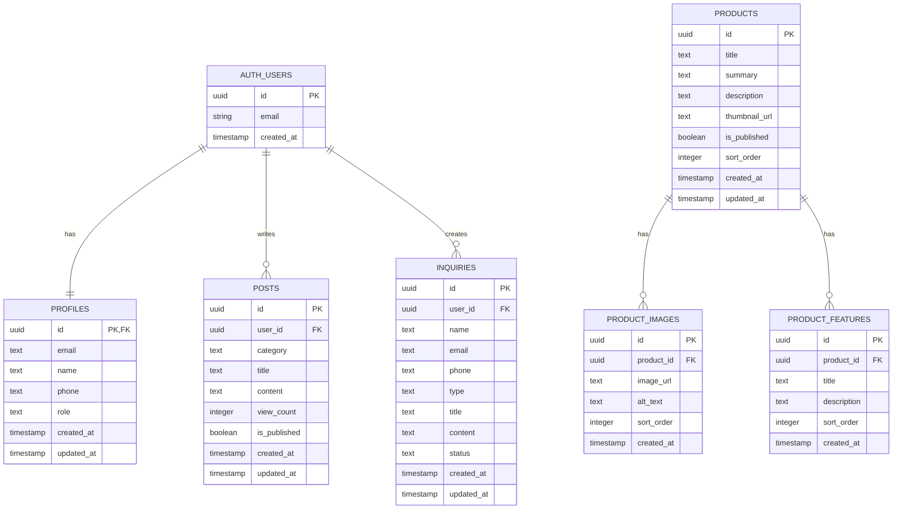

# CLAUDE.md

## 프로젝트 개요

이 프로젝트는 React, Tailwind CSS, Supabase를 기반으로 제작하는 제품 및 회사 소개 홈페이지입니다.

주요 목적은 회사의 신뢰도 있는 소개, 제품 정보 제공, 회원 기반 커뮤니티 운영, 온라인 문의 접수 기능을 제공하는 것입니다.

초기 MVP에서는 댓글 기능을 제외하고 게시글 중심의 커뮤니티를 구현합니다.

> 디자인 시스템: [docs/design-system.md](docs/design-system.md)

## 기술 스택

### Frontend

* React
* Vite
* TypeScript 권장
* Tailwind CSS
* React Router
* React Hook Form 권장
* Zod 권장

### Backend / BaaS

* Supabase

  * Authentication
  * PostgreSQL Database
  * Row Level Security
  * Storage
  * Edge Functions 선택 사항

### Supabase 접근 방식

Claude는 Supabase 작업 시 MCP를 통해 프로젝트 상태를 확인하고 작업을 보조합니다.

React 앱 자체는 Supabase JS Client를 사용해 Supabase에 접근합니다.

```txt
Supabase MCP
→ Claude가 DB 상태 확인, SQL 작성, 마이그레이션 검토, RLS 점검에 사용

Supabase JS Client
→ React 프론트엔드가 로그인, 게시글, 문의, 제품 데이터를 실제로 조회/생성할 때 사용
```

## 상태 관리

초기 MVP에서는 전역 상태 관리 라이브러리를 최소화합니다.

우선순위:

1. React 기본 state
2. Context API
3. 필요 시 Zustand 도입

## 개발 목표

### 핵심 페이지

프로젝트는 다음 페이지를 포함합니다.

* 홈
* 회사소개
* 제품소개
* 온라인 문의
* 커뮤니티 / 게시판
* 로그인
* 회원가입
* 마이페이지
* 관리자 페이지

## 사이트맵

```txt
/
├── /about
├── /products
│   └── /products/:id
├── /inquiry
├── /community
│   ├── /community
│   ├── /community/new
│   └── /community/:id
├── /login
├── /signup
├── /mypage
└── /admin
    ├── /admin/products
    ├── /admin/inquiries
    ├── /admin/posts
    └── /admin/users
```

## 주요 기능

## 1. 제품 및 회사 소개 홈페이지

### 홈

홈 화면은 서비스의 첫인상을 결정하는 페이지입니다.

포함 요소:

* 메인 히어로 섹션
* 회사 핵심 메시지
* 대표 제품 소개
* 주요 강점
* 온라인 문의 CTA
* 커뮤니티 또는 공지사항 일부 노출

### 회사소개

포함 요소:

* 회사 개요
* 비전 및 미션
* 주요 사업 영역
* 연혁
* 조직 또는 브랜드 소개
* 연락처 및 위치 정보

### 제품소개

포함 요소:

* 제품 리스트
* 제품 상세 페이지
* 제품 이미지
* 제품 설명
* 주요 기능
* 활용 사례
* 문의하기 버튼

제품 데이터는 Supabase DB에서 관리할 수 있도록 설계합니다.

## 2. 회원관리

Supabase Auth를 사용합니다.

### 회원가입

필수 입력값:

* 이메일
* 비밀번호
* 이름
* 연락처 선택 사항

회원가입 후 기본 role은 `user`로 설정합니다.

### 로그인

* 이메일 / 비밀번호 로그인
* 로그인 상태 유지
* 비로그인 사용자의 보호 페이지 접근 제한

### 로그아웃

* Supabase Auth signOut 사용

### 마이페이지

포함 요소:

* 내 정보 조회
* 내 게시글 조회
* 내 문의 내역 조회
* 회원 정보 수정 선택 사항

## 3. 권한 구조

기본 role은 다음과 같습니다.

```ts
type UserRole = 'admin' | 'user';
```

### user

일반 회원입니다.

가능한 기능:

* 제품소개 조회
* 온라인 문의 작성
* 커뮤니티 글 작성
* 본인 글 수정 / 삭제
* 본인 문의 내역 조회

### admin

관리자입니다.

가능한 기능:

* 제품 등록 / 수정 / 삭제
* 문의 전체 조회 및 답변 상태 관리
* 커뮤니티 글 관리
* 회원 목록 조회
* 공지사항 작성

## 4. 온라인 문의

온라인 문의는 비회원 또는 회원 모두 작성 가능하도록 설계합니다.

단, 회원이 작성한 경우 user_id를 함께 저장합니다.

### 문의 작성 필드

* 이름
* 이메일
* 연락처
* 문의 유형
* 제목
* 내용
* 첨부파일 선택 사항

### 문의 상태

```ts
type InquiryStatus = 'pending' | 'in_progress' | 'completed';
```

상태 의미:

* pending: 접수 완료
* in_progress: 확인 중
* completed: 답변 완료

관리자는 문의 상태를 변경할 수 있습니다.

## 5. 커뮤니티 / 게시판

회원 기반 게시판입니다.

초기 MVP에서는 댓글 기능을 제외하고 게시글 중심으로 구현합니다.

### 게시글 기능

* 게시글 목록
* 게시글 상세
* 게시글 작성
* 게시글 수정
* 게시글 삭제
* 조회수
* 작성자 표시
* 작성일 표시

### 게시판 유형

초기에는 단일 게시판으로 구현합니다.

확장 가능 구조:

```ts
type PostCategory = 'notice' | 'free' | 'qna';
```

* notice: 공지사항
* free: 자유게시판
* qna: 질문게시판

공지사항 작성은 관리자만 가능합니다.

## Supabase DB 설계

> 상세 스키마: [docs/database/schema.md](docs/database/schema.md)

## ERD



## 테이블 요약

| 테이블                | 역할                      |
| ------------------ | ----------------------- |
| `profiles`         | Supabase Auth 사용자 추가 정보 |
| `products`         | 제품 소개 데이터               |
| `product_images`   | 제품별 상세 이미지              |
| `product_features` | 제품별 주요 기능               |
| `inquiries`        | 온라인 문의                  |
| `posts`            | 커뮤니티 게시글                |

## 관계 구조

```txt
auth.users
  └── profiles 1:1

auth.users
  ├── posts 1:N
  └── inquiries 1:N

products
  ├── product_images 1:N
  └── product_features 1:N
```

## SQL

### profiles

```sql
create table profiles (
  id uuid primary key references auth.users(id) on delete cascade,
  email text not null,
  name text,
  phone text,
  role text not null default 'user' check (role in ('admin', 'user')),
  created_at timestamp with time zone default now(),
  updated_at timestamp with time zone default now()
);
```

### products

```sql
create table products (
  id uuid primary key default gen_random_uuid(),
  title text not null,
  summary text,
  description text,
  thumbnail_url text,
  is_published boolean default true,
  sort_order integer default 0,
  created_at timestamp with time zone default now(),
  updated_at timestamp with time zone default now()
);
```

### product_images

```sql
create table product_images (
  id uuid primary key default gen_random_uuid(),
  product_id uuid not null references products(id) on delete cascade,
  image_url text not null,
  alt_text text,
  sort_order integer default 0,
  created_at timestamp with time zone default now()
);
```

### product_features

```sql
create table product_features (
  id uuid primary key default gen_random_uuid(),
  product_id uuid not null references products(id) on delete cascade,
  title text not null,
  description text,
  sort_order integer default 0,
  created_at timestamp with time zone default now()
);
```

### inquiries

```sql
create table inquiries (
  id uuid primary key default gen_random_uuid(),
  user_id uuid references auth.users(id) on delete set null,
  name text not null,
  email text not null,
  phone text,
  type text,
  title text not null,
  content text not null,
  status text not null default 'pending'
    check (status in ('pending', 'in_progress', 'completed')),
  created_at timestamp with time zone default now(),
  updated_at timestamp with time zone default now()
);
```

### posts

```sql
create table posts (
  id uuid primary key default gen_random_uuid(),
  user_id uuid not null references auth.users(id) on delete cascade,
  category text not null default 'free'
    check (category in ('notice', 'free', 'qna')),
  title text not null,
  content text not null,
  view_count integer default 0,
  is_published boolean default true,
  created_at timestamp with time zone default now(),
  updated_at timestamp with time zone default now()
);
```

## Supabase MCP 작업 지침

Claude는 Supabase MCP를 사용할 수 있는 환경에서는 다음 순서로 작업합니다.

### 1. 현재 프로젝트 상태 확인

Supabase 관련 작업 전 MCP를 통해 다음 항목을 먼저 확인합니다.

* 연결된 Supabase 프로젝트
* 기존 테이블
* 기존 컬럼
* 기존 외래키 관계
* 기존 RLS 정책
* 기존 함수 및 트리거
* 기존 Storage 버킷

### 2. 변경 계획 제안

DB 변경이 필요한 경우 SQL 실행 전에 다음 내용을 먼저 정리합니다.

* 생성할 테이블
* 수정할 테이블
* 추가할 컬럼
* 제거할 컬럼
* 외래키 관계
* RLS 정책
* 예상 영향 범위

### 3. SQL 작성 기준

SQL은 Supabase PostgreSQL 기준으로 작성합니다.

작성 기준:

* `uuid` 기본키는 `gen_random_uuid()` 사용
* 시간 컬럼은 `timestamp with time zone default now()` 사용
* 사용자 참조는 `auth.users(id)` 기준
* 삭제 정책은 기능에 맞게 `cascade` 또는 `set null` 명시
* enum 성격의 값은 초기 MVP에서는 `text check` 제약으로 처리
* 재실행 가능성을 고려해 작성
* 기존 테이블과 컬럼이 있을 가능성을 고려

### 4. 실행 제한

다음 작업은 사용자 확인 없이 실행하지 않습니다.

* 테이블 삭제
* 컬럼 삭제
* 데이터 삭제
* RLS 정책 대규모 변경
* 기존 데이터 구조를 깨뜨릴 수 있는 마이그레이션
* 관리자 권한 관련 정책 변경

## Supabase 클라이언트 설정

React 앱에서는 Supabase MCP가 아니라 Supabase JS Client를 사용합니다.

MCP는 Claude의 개발 보조 및 DB 관리 접근에 사용하고, 실제 프론트엔드 앱은 아래 클라이언트를 통해 Supabase에 접근합니다.

```ts
import { createClient } from '@supabase/supabase-js';

const supabaseUrl = import.meta.env.VITE_SUPABASE_URL;
const supabaseAnonKey = import.meta.env.VITE_SUPABASE_ANON_KEY;

export const supabase = createClient(supabaseUrl, supabaseAnonKey);
```

`.env` 예시:

```env
VITE_SUPABASE_URL=
VITE_SUPABASE_ANON_KEY=
```

## RLS 정책 방향

Supabase 테이블은 Row Level Security를 활성화합니다.

### profiles

* 사용자는 본인 프로필만 조회 / 수정 가능
* 관리자는 전체 사용자 조회 가능

### products

* 누구나 공개 제품 조회 가능
* 관리자만 등록 / 수정 / 삭제 가능

### product_images

* 누구나 공개 제품 이미지 조회 가능
* 관리자만 등록 / 수정 / 삭제 가능

### product_features

* 누구나 공개 제품 기능 조회 가능
* 관리자만 등록 / 수정 / 삭제 가능

### inquiries

* 비회원도 문의 작성 가능
* 회원은 본인 문의 조회 가능
* 관리자는 전체 문의 조회 가능
* 관리자는 문의 상태 수정 가능

### posts

* 누구나 게시글 조회 가능
* 로그인 사용자는 게시글 작성 가능
* 작성자는 본인 글 수정 / 삭제 가능
* 관리자는 전체 글 수정 / 삭제 가능
* 공지사항 작성은 관리자만 가능

## 권장 폴더 구조

```txt
src/
├── app/
│   ├── App.tsx
│   └── router.tsx
├── components/
│   ├── common/
│   ├── layout/
│   ├── forms/
│   └── ui/
├── features/
│   ├── auth/
│   ├── products/
│   ├── inquiries/
│   ├── community/
│   └── admin/
├── hooks/
├── lib/
│   ├── supabase.ts
│   └── utils.ts
├── pages/
│   ├── HomePage.tsx
│   ├── AboutPage.tsx
│   ├── ProductsPage.tsx
│   ├── ProductDetailPage.tsx
│   ├── InquiryPage.tsx
│   ├── CommunityPage.tsx
│   ├── PostDetailPage.tsx
│   ├── PostWritePage.tsx
│   ├── LoginPage.tsx
│   ├── SignupPage.tsx
│   ├── MyPage.tsx
│   └── AdminPage.tsx
├── types/
└── styles/
```

## 컴포넌트 작성 규칙

컴포넌트는 기능 단위로 분리합니다.

권장 방식:

```tsx
type ProductCardProps = {
  title: string;
  summary: string;
  thumbnailUrl?: string;
};

export function ProductCard({
  title,
  summary,
  thumbnailUrl,
}: ProductCardProps) {
  return (
    <article className="rounded-xl border bg-white p-6 shadow-sm">
      {thumbnailUrl && (
        
      )}
      <h3 className="text-lg font-semibold">{title}</h3>
      <p className="mt-2 text-sm text-gray-600">{summary}</p>
    </article>
  );
}
```

## 네이밍 규칙

### 파일명

컴포넌트 파일은 PascalCase를 사용합니다.

```txt
ProductCard.tsx
InquiryForm.tsx
CommunityPostList.tsx
```

유틸 함수 파일은 camelCase를 사용합니다.

```txt
formatDate.ts
getUserRole.ts
```

### 변수명 / 함수명

camelCase를 사용합니다.

```ts
const productList = [];
const inquiryStatus = 'pending';

function getProductList() {}
function createInquiry() {}
```

### 타입명

PascalCase를 사용합니다.

```ts
type Product = {};
type InquiryStatus = {};
type UserRole = {};
```

## Tailwind CSS 스타일 규칙

> 상세 구현 가이드 및 `tailwind.config.ts` 전체 설정: [docs/design-system.md](docs/design-system.md#tailwind-css-구현)

디자인 시스템의 모든 토큰은 `tailwind.config.ts`의 `theme.extend`에 등록하고, 컴포넌트에서는 Tailwind 유틸리티 클래스로만 사용한다.

### 핵심 원칙

* 색상 하드코딩 금지 — `bg-[#5e6ad2]` 대신 `bg-primary` 사용
* 기본 레이아웃: `max-w-content mx-auto px-4 sm:px-6 lg:px-8`
* 버튼, 카드, 입력창은 재사용 가능한 컴포넌트로 분리
* 다크 테마 고정 — `dark:` 접두어 불필요, 라이트 모드 클래스 추가 금지

### 주요 토큰 → 클래스 대응

| 역할 | 클래스 |
|---|---|
| 페이지 배경 | `bg-canvas` |
| 카드 배경 | `bg-surface-1` |
| 호버 카드 / 추천 티어 | `bg-surface-2` |
| 프라이머리 버튼 | `bg-primary hover:bg-primary-hover` |
| 보더 | `border border-hairline` |
| 헤드라인 텍스트 | `text-ink` |
| 서브 텍스트 | `text-ink-muted` |
| 히어로 헤드라인 | `text-display-xl font-semibold` |
| 본문 | `text-body` |
| 버튼 레이블 | `text-button font-medium` |
| 카드 코너 | `rounded-lg` |
| CTA 버튼 코너 | `rounded-md` |
| 섹션 간격 | `py-section` |
| 카드 내부 패딩 | `p-lg` |

## 권장 UI 스타일

전체 톤은 회사 소개 홈페이지에 맞게 신뢰감 있고 깔끔하게 구성합니다.

권장 스타일:

* 넓은 여백
* 명확한 섹션 구분
* 카드형 제품 소개
* 간결한 CTA 버튼
* 관리자 페이지는 기능 중심의 테이블 UI
* 커뮤니티는 가독성 중심의 리스트 UI

## 인증 처리 규칙

로그인 상태는 Supabase Auth 세션을 기준으로 확인합니다.

보호 페이지:

* `/mypage`
* `/community/new`
* `/admin`

관리자 전용 페이지:

* `/admin`
* `/admin/products`
* `/admin/inquiries`
* `/admin/posts`
* `/admin/users`

관리자 권한은 `profiles.role === 'admin'` 기준으로 판단합니다.

관리자 권한 처리는 프론트엔드 조건부 렌더링만으로 끝내지 않고, Supabase RLS 정책과 함께 구현합니다.

## 개발 순서

## 1단계: 프로젝트 초기 세팅

* Vite React 프로젝트 생성
* Tailwind CSS 설정
* React Router 설정
* Supabase 클라이언트 설정
* 기본 레이아웃 구성

## 2단계: 정적 페이지 구현

* 홈
* 회사소개
* 제품소개
* 온라인 문의
* 커뮤니티 목록 UI

## 3단계: 인증 구현

* 회원가입
* 로그인
* 로그아웃
* 세션 유지
* 보호 라우트 구현

## 4단계: Supabase DB 연동

* 제품 목록 조회
* 제품 상세 조회
* 문의 작성
* 게시글 목록 조회
* 게시글 상세 조회
* 게시글 작성 / 수정 / 삭제

## 5단계: 관리자 기능 구현

* 제품 관리
* 문의 관리
* 게시글 관리
* 회원 관리

## 6단계: polish

* 반응형 UI 정리
* 로딩 / 에러 상태 처리
* 빈 상태 UI 처리
* 접근성 점검
* SEO 메타 태그 정리

## Claude 작업 지침

Claude는 코드를 작성할 때 다음 기준을 따릅니다.

1. React + TypeScript 기준으로 작성한다.
2. Tailwind CSS를 사용해 스타일링한다.
3. Supabase 연동 코드는 `src/lib/supabase.ts`를 기준으로 작성한다.
4. Supabase 관련 작업은 가능한 경우 MCP를 통해 현재 상태를 확인한 뒤 진행한다.
5. 기존 DB 상태를 확인하지 않고 테이블 생성 SQL을 임의로 확정하지 않는다.
6. 테이블, 컬럼, 정책이 이미 존재할 가능성을 고려한다.
7. SQL은 재실행 가능성을 고려해 작성한다.
8. 기존 데이터가 손상될 수 있는 작업은 반드시 사용자 확인을 요청한다.
9. 컴포넌트는 재사용 가능하도록 작게 분리한다.
10. 한 파일에 너무 많은 로직을 넣지 않는다.
11. API 호출 로직은 feature 또는 hook으로 분리한다.
12. 관리자 권한이 필요한 기능은 반드시 role 체크를 포함한다.
13. 사용자 입력값은 검증한다.
14. 로딩, 에러, 빈 데이터 상태를 UI에 반영한다.
15. 불필요한 라이브러리는 추가하지 않는다.
16. MVP에서는 복잡한 상태 관리 도입을 피한다.
17. 실제 배포 가능한 구조를 우선한다.
18. 초기 MVP에서는 댓글 기능을 구현하지 않는다.
19. `comments` 테이블, 댓글 API, 댓글 UI, 댓글 RLS 정책은 생성하지 않는다.

## 구현 시 주의사항

* Supabase service role key는 프론트엔드에 절대 노출하지 않는다.
* `.env` 파일은 Git에 커밋하지 않는다.
* 관리자 권한 처리는 프론트엔드 조건부 렌더링만으로 끝내지 않는다.
* 반드시 Supabase RLS 정책과 함께 처리한다.
* 게시글, 문의, 제품 등록 시 입력값 검증을 적용한다.
* 비회원 문의 기능은 스팸 방지 대책을 추후 고려한다.
* 파일 업로드 기능은 초기 MVP 이후 확장 기능으로 둔다.
* 댓글 기능은 현재 범위에서 제외한다.
* Supabase MCP는 Claude의 DB 작업 보조용이며, React 앱 런타임 접근 방식은 Supabase JS Client이다.

## MVP 범위

초기 MVP에서는 다음 기능을 우선 구현합니다.

* 홈
* 회사소개
* 제품소개 목록 / 상세
* 회원가입 / 로그인 / 로그아웃
* 온라인 문의 작성
* 커뮤니티 게시글 목록 / 상세 / 작성
* 관리자 문의 목록 조회
* 관리자 제품 등록 / 수정
* 관리자 게시글 관리
* 관리자 회원 목록 조회

## 제외 범위

초기 MVP에서는 다음 기능을 제외합니다.

* 댓글 기능
* 댓글 테이블
* 댓글 API
* 댓글 UI
* 댓글 RLS 정책
* 게시글 좋아요
* 제품 검색
* 파일 첨부
* 이미지 업로드
* 문의 답변 메일 발송

## 추후 확장 기능

* 제품 검색
* 게시글 좋아요
* 문의 답변 메일 발송
* 관리자 대시보드
* 제품 카테고리 관리
* 파일 첨부
* 이미지 업로드
* SEO 최적화
* 다국어 지원
* 공지사항 고정 기능
* 댓글 기능

## 완료 기준

프로젝트의 1차 완료 기준은 다음과 같습니다.

* 사용자는 회사와 제품 정보를 확인할 수 있다.
* 사용자는 회원가입과 로그인을 할 수 있다.
* 로그인 사용자는 커뮤니티 게시글을 작성할 수 있다.
* 사용자는 온라인 문의를 남길 수 있다.
* 사용자는 본인 게시글을 수정하거나 삭제할 수 있다.
* 사용자는 본인 문의 내역을 확인할 수 있다.
* 관리자는 제품 정보를 관리할 수 있다.
* 관리자는 문의 내역을 확인하고 상태를 변경할 수 있다.
* 관리자는 커뮤니티 게시글을 관리할 수 있다.
* 모든 주요 페이지는 모바일과 데스크톱에서 정상적으로 표시된다.
